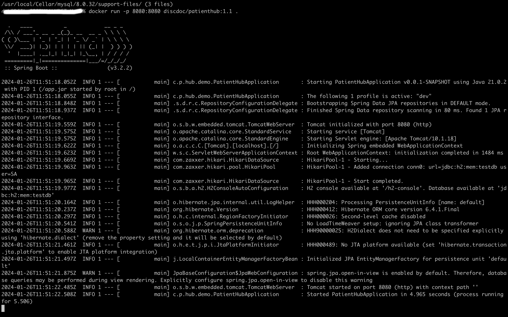
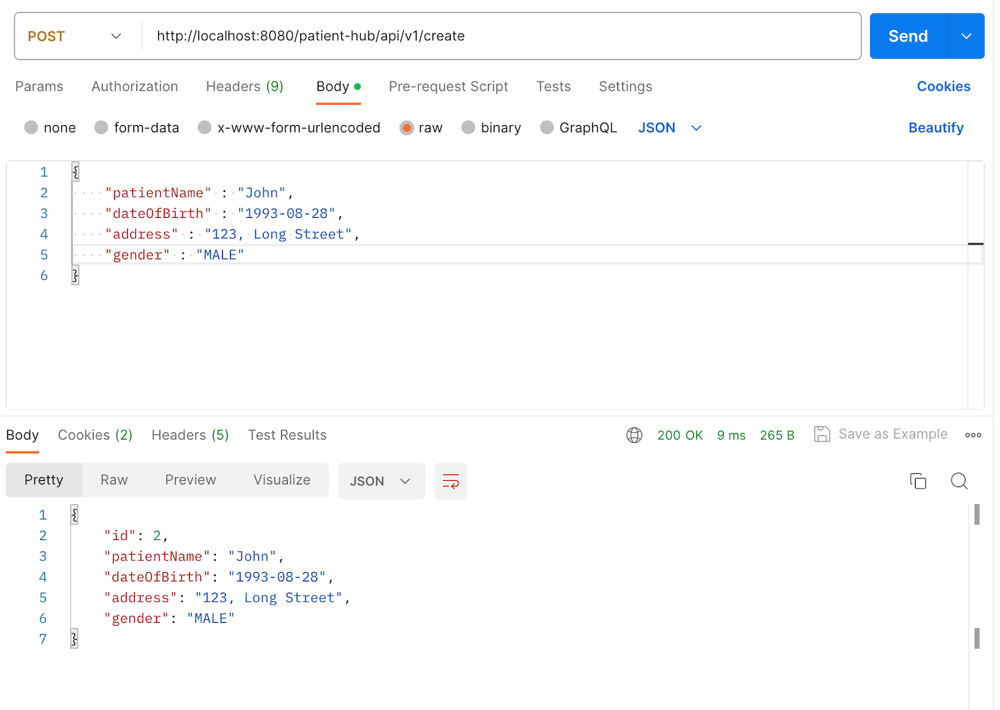
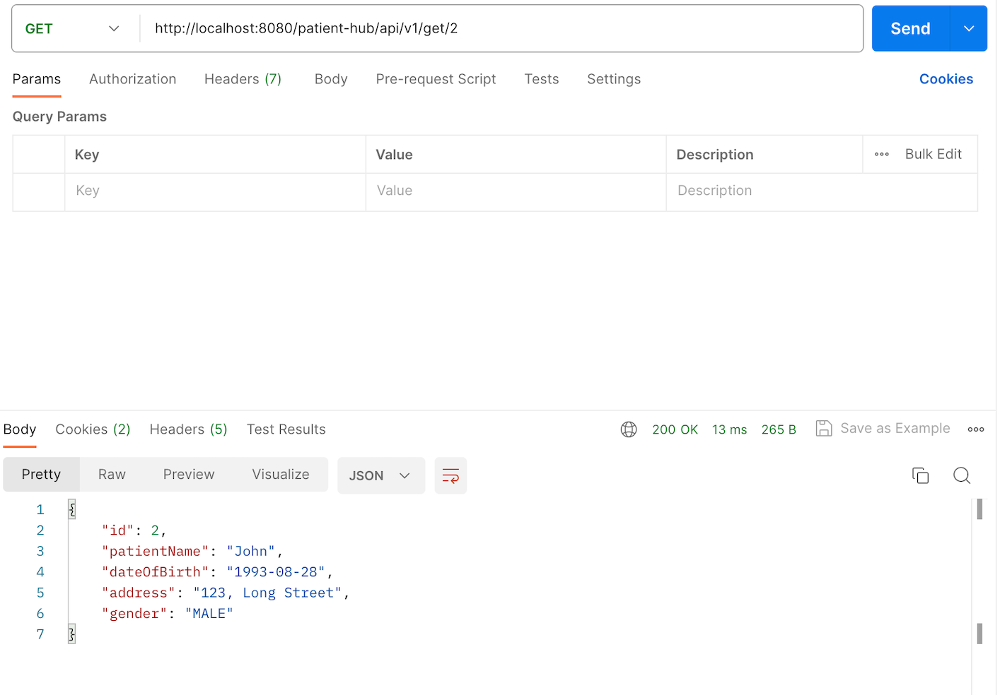
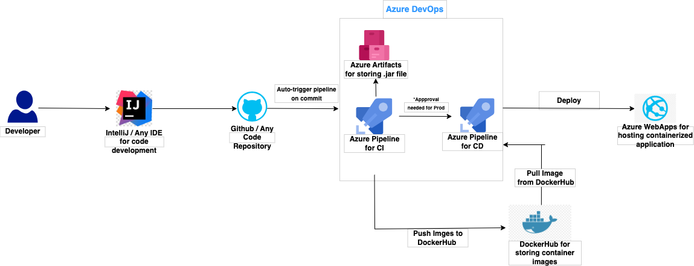

# Patient-Hub-Demo
### A sample project to demonstrate my Java, Spring Boot and REST API skills
A containerized patient hub application to perform CRUD operations on patient data.

# Running the application
```shell
docker run -p 8080:8080 discdoc/patienthub:1.2 .
```


# API Endpoints
This application hosts 4 REST APIs to create, read, update and delete a patient record.
| HTTP Verbs |          Endpoints            |       Action                                   |
| ---------- | ----------------------------- | ---------------------------------------------- |
|    POST    | patient-hub/api/v1/create     | To create a new patient record                 |
|    GET     | patient-hub/api/v1/get/{id}   | To retrieve an existing patient record with id |
|    PUT     | patient-hub/api/v1/update/{id}| To update an existing patient record with id   |
|    DELETE  | patient-hub/api/v1/delete/{id}| To delete an existing patient record with id   |





# Tech Stack
* Java
* Spring Boot
* H2 Database for local and dev environments
* MySQL Database for higher environments

# Pipeline

